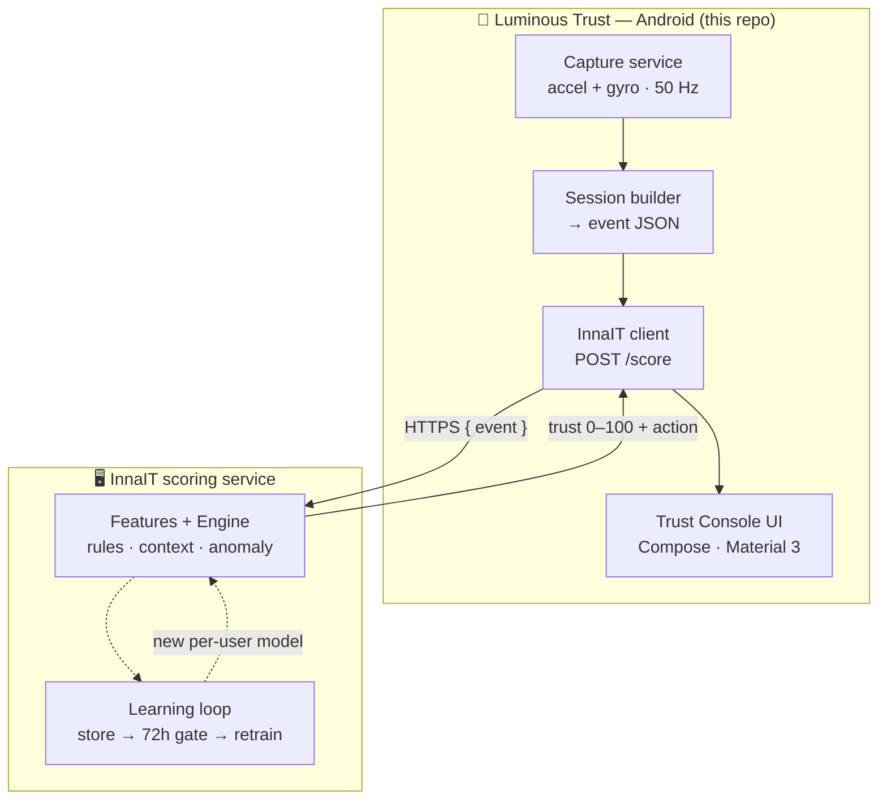

<div align="center">

# 🌿 Luminous Trust

### Continuous behavioral-biometrics for mobile banking — the on-device half

*Your phone senses **how** you behave, a scoring engine decides if it's really you, and the session earns one of three doors: **ALLOW · STEP&#95;UP · BLOCK**.*

<br/>

[](https://github.com/Krithiikaa/Luminous-Trust/actions/workflows/build.yml)


</div>

---

## ✨ Overview

**Luminous Trust** is the Android client of a continuous **behavioral fraud-intelligence** system. Instead of trusting a user once at login, it *keeps* verifying them — passively — from the way they hold and touch the phone. Each session is scored **0–100** and mapped to a proportionate action, so genuine users glide through and risky ones meet friction only when it's warranted.

It captures signal on the device, ships **only derived statistics** (never raw keystrokes or content), and lets the intelligence live and improve **server-side** — so the model can get smarter without ever re-installing the app.

> [!NOTE]
> This repo is the **phone half**. It talks to the [InnaIT](#-how-scoring-works) scoring service over a single HTTP call. This is an early **prototype scaffold** — see [Limitations](#-limitations--honest-status).

---

## 🚀 Features

| | Feature | What it does |
|---|---|---|
| 📡 | **Always-on motion capture** | Foreground service reads accelerometer + gyroscope at ~50 Hz and keeps a rolling micro-tremor / tilt summary. |
| 🧬 | **Session builder** | Assembles the exact JSON the scoring engine expects (device, integrity, network, motion, session). |
| 🔐 | **Privacy at the edge** | Only statistical features leave the device — no raw key values, no content. |
| ⚡ | **One score, three doors** | `ALLOW` (silent) · `STEP_UP` (extra factor) · `BLOCK` (stop + alert). |
| 🩺 | **Trust Console UI** | A clean, clinical dashboard showing the live trust score, action, and reason codes. |
| 🔄 | **OTA-friendly** | The model updates on the server; the app keeps calling the same endpoint. |
| 🎨 | **Brand-native design** | Built on the *Luminous Bio-Tech* Material 3 design system. |

---

## 🏗️ Architecture



**The split is the whole idea:** the phone only **captures** and **acts** (so it rarely changes), while the server does the **thinking** and the **learning** (so intelligence evolves without touching the app).

---

## 🧠 How scoring works

The server assembles the trust score in three transparent layers:

```
100  ─┐
      │  Layer 1 · Hard rules      root / emulator / Frida / screen-share  → force BLOCK
      │  Layer 2 · Context penalty  Tor −35 · SIM-swap −30 · pasted payee −20 · …
      │  Layer 3 · Behavioral fit   per-user anomaly model (biggest lever, up to −45)
  0  ─┘
```

Every deduction is returned as a **human-readable reason code**, so any decision is auditable.

| Trust score | Risk | Action |
|:---:|:---:|:---:|
| **80–100** | 🟢 LOW | `ALLOW` — proceed silently |
| **40–79** | 🟡 MEDIUM | `STEP_UP` — one more factor |
| **0–39** | 🔴 HIGH | `BLOCK` — stop + alert |

---

## 🧰 Tech stack

- **Language:** Kotlin 2.0
- **UI:** Jetpack Compose · Material 3
- **Networking:** `HttpURLConnection` + `org.json` (zero heavy dependencies)
- **Sensors:** `SensorManager` (accelerometer, gyroscope)
- **Min / Target SDK:** 26 / 35
- **CI:** GitHub Actions → downloadable APK artifact

---

## 📂 Project structure

```text
app/src/main/java/com/luminous/trust/
├── MainActivity.kt                 # entry point · starts capture · hosts Compose
├── ui/
│   ├── TrustScreen.kt              # the branded Trust Console
│   └── theme/                      # Color · Type · Shape · Theme  ← DESIGN.md
├── capture/
│   ├── SensorCaptureService.kt     # Phase 1: always-on motion capture
│   └── SessionBuilder.kt           # builds the InnaIT /score event JSON
└── net/
    ├── InnaitClient.kt             # POST /score
    └── ScoreModels.kt              # response + UI state types
```

---

## 🛠️ Build the APK

### ☁️ Option A — In the cloud (no Android Studio, no local SDK)

Every push builds the APK automatically via GitHub Actions. 🎉

```bash
# 1. clone (or push your own code)
git clone https://github.com/Krithiikaa/Luminous-Trust.git
cd Luminous-Trust

# 2. make a change, then push
git add .
git commit -m "your change"
git push
```

Then open the repo's **Actions** tab → click the latest green ✅ run → download **`LuminousTrust-debug-apk`** from the **Artifacts** section → unzip → install `app-debug.apk` on your phone.

You can also trigger it manually: **Actions → Build APK → Run workflow**.

### 💻 Option B — Locally (if you have the Android SDK)

```bash
./gradlew assembleDebug
# → app/build/outputs/apk/debug/app-debug.apk
```

---

## ⚙️ Configuration

Set inside the app on the Trust Console screen:

| Field | Default | Meaning |
|---|---|---|
| **User ID** | `PB0366` | which profile to score against |
| **Scoring server** | `http://10.0.2.2:8080` | the InnaIT `/score` endpoint (`10.0.2.2` = your PC as seen from the emulator) |

Start the Python scoring service (`./run.sh`) and the app connects straight to it.

---

## 🎨 Design system — *Luminous Bio-Tech*

High-precision science meets organic vitality: a stark obsidian-and-white clinical ground, lit by a single **Growth Green** `#7AC943` accent.

- 🟩 **Primary / CTA** — Growth Green
- ⬜ **Surfaces** — white cards on near-white, 1px hairline outlines, no heavy shadows
- 🔤 **Type** — Montserrat (headlines) + Libre Franklin (body)
- 🔲 **Shapes** — 4px radius (buttons/inputs), 8px (cards/chips)

> The `DESIGN.md` tokens are Material 3 role names, so they drop straight into the Compose theme in `ui/theme/`.

---

## 🗺️ Roadmap

- [x] Motion capture (accelerometer + gyroscope)
- [x] Session builder + `/score` client
- [x] Branded Trust Console UI
- [x] Cloud CI build (GitHub Actions)
- [ ] ✋ **Real touch & keystroke capture** *(biggest accuracy win)*
- [ ] 🔒 Device Admin → `lockNow()` so `BLOCK` locks the screen
- [ ] 🔤 Load real Montserrat + Libre Franklin fonts
- [ ] 💾 Offline queue + retry, encrypted on-device buffers

---

## ⚠️ Limitations & honest status

- **Prototype scaffold** — generated outside the Android toolchain; expect the odd first-build tweak.
- **Touch capture is stubbed** — `SessionBuilder` currently sends zeros for touch/keystroke fields, so scores lean on motion + context. Wiring real touch capture is the next milestone.
- **Auth is off by default** on the server side — put HTTPS + an API key in front before any non-local use.

---

## 🤝 Contributing

Issues and PRs welcome. Please keep changes small and focused, and describe *why* as well as *what*.

## 📄 License

No license file yet — add one (e.g. **MIT**) to declare how others may use this. Until then, all rights reserved by the author.

---

<div align="center">

**Built with 🌿 for safer digital banking.**

</div>
